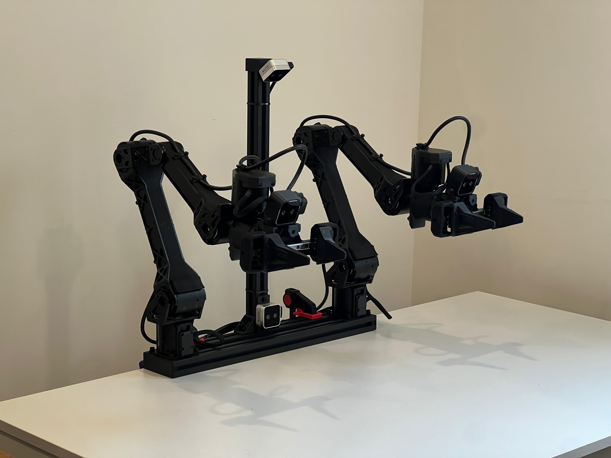

  

# Bimanual Follower Arm Setup

This rig is built from an **aluminium-extrusion frame** that carries two [ARX-R5](https://arx-x.com/?product/22.html) *or* [Trossen WidowX-AI](https://www.trossenrobotics.com/widowx-ai) arms.  
The whole assembly can be repositioned quickly and locked in place with **quick-release clamps**.

---

## Camera Options

Several printable mounts are included (STLs in this repo). Proven layouts:

- **1 × Intel RealSense D405** — top-mounted  
- **2 × Intel RealSense D405** — stereo, top-mounted  
- **1 × Intel RealSense D435** — top-mounted  
- **1 × Intel RealSense D405** — belly-mounted  

Select the configuration that best matches your task or experiment with new ones.

---

## Bill of Materials — Frame

tbd 

### 3-D-Printed Parts

- 2 × **Angle brackets**  
- 2 × **Side plates**  
- **Cable-routing clips**  
- 2 × **Arm adapter plates** (for ARX-R5; omit when mounting WidowX-AI)
- **Camera mounting** as needed

---

