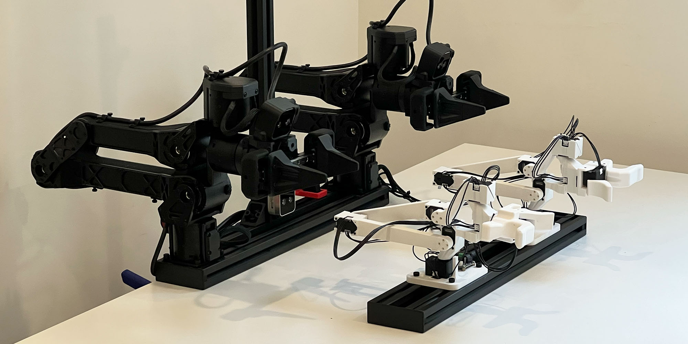

# TRLC Hardware

<!-- 

  

 -->

## Leader Arm Design - ARX R5 & Trossen AI
This repo contains a leader arm design which is kinematically equivalent to two robot arms: **ARX R5** and **Trossen AI** at 60% of their scale.

  

## Integrations
Software integrations for both arm types can be found in [our fork of LeRobot](https://github.com/robot-learning-co/lerobot). Check out the corresponding branches. 

**(Update to LeRobot's new Hardware API coming soon.)**

## Acknowledgements
This project would not have been possible without:
- [GELLO](https://wuphilipp.github.io/gello_site/) by Philipp Wu et al.
- [LeRobot](https://github.com/huggingface/lerobot) by HuggingFace