

  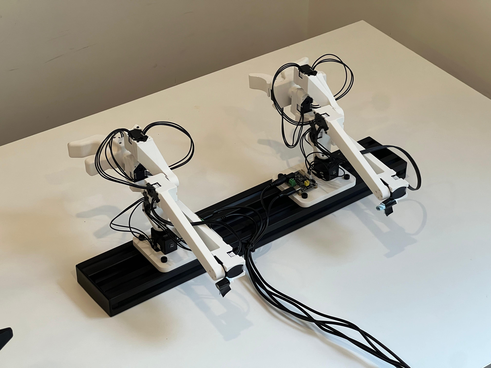

# Compact Leader Arm

This **leader arm** is **kinematically equivalent** to the [ARX-R5](https://arx-x.com/?product/22.html) and [Trossen WidowX-AI](https://www.trossenrobotics.com/widowx-ai) arms.
It is **60 % of their size** and around **USD 186** in parts, an affordable alternative for teleoperation.

Because the X330 actuators are **highly back-drivable**, the arm feels smooth and effortless when you guide it by hand—ideal for precise motion demonstrations. Especialy the gripper on the original arms is hard to close when using the same base arm for leader and flower.  
> **Limitations:** The design does **not include force-feedback sensors**.

The gripper is adapted from [Philipp Wu’s open-source model](<https://github.com/wuphilipp/gello_mechanical>).

---

## Bill of Materials (per arm)

| Qty | Item | Link | Price |
|-----|------|------|-------|
| 7 × | **Dynamixel XL330-M077-T** | [ROBOTIS](<https://en.robotis.com/shop_en/item.php?it_id=902-0162-000>) | $23.90
| 1 × | **Servo Control Board**| [Amazon](<https://www.amazon.com/dp/B0CTMM4LWK>) | $10.55 |
| 1 × | **power supply** 5V | [Amazon](<https://www.amazon.com/dp/B09W8X9VGK>) | $7.99 |
| 1 × | **USB-C cable** | — |
| —   | **3-D-printed parts** (STLs below) | — |

### 3-D-Printed Parts

<table>
  <tr>
    <td align="center"> Part 1</td>
    <td align="center">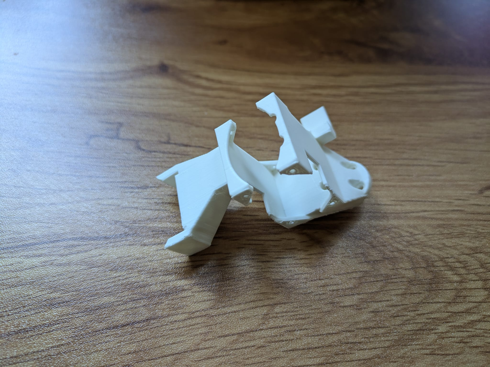 Part 2</td>
    <td align="center">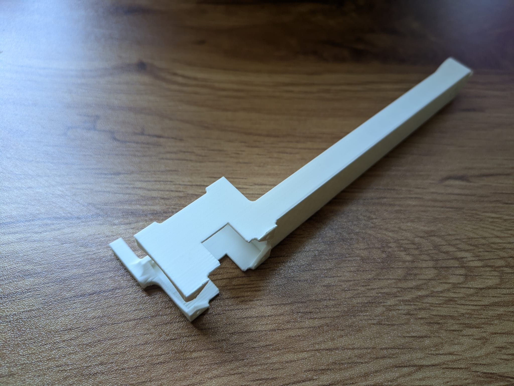 Part 3</td>
    <td align="center">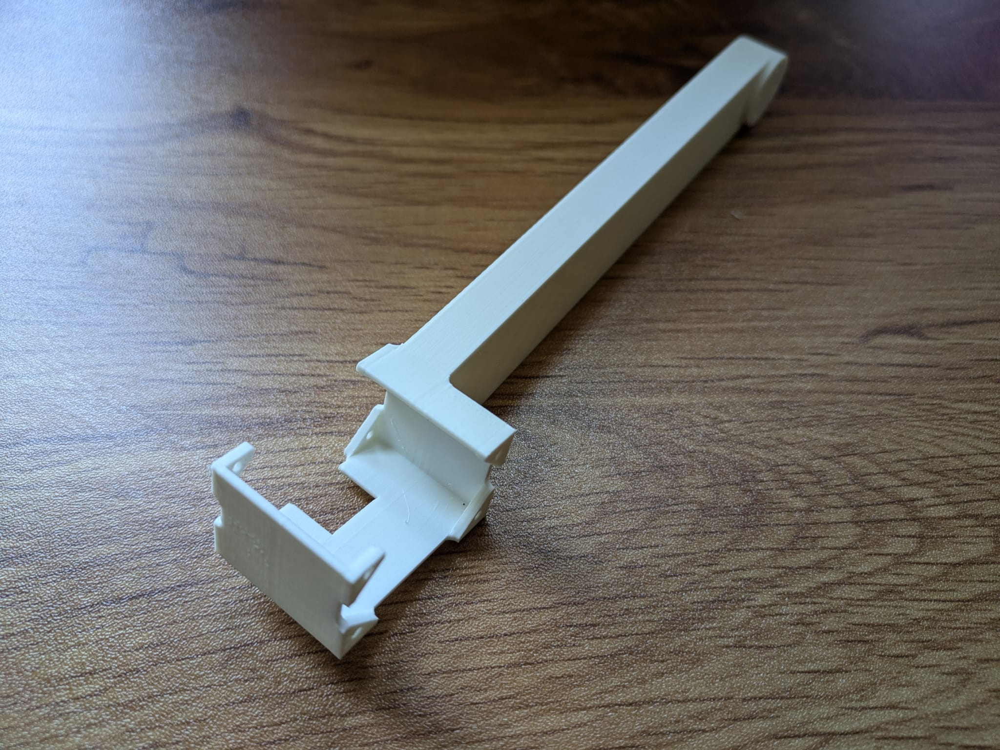 Part 4</td>
    <td align="center">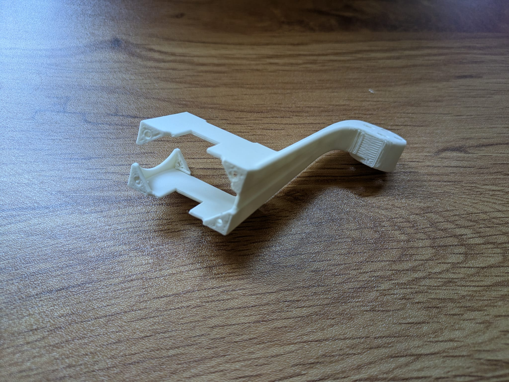 Part 5</td>
    <td align="center">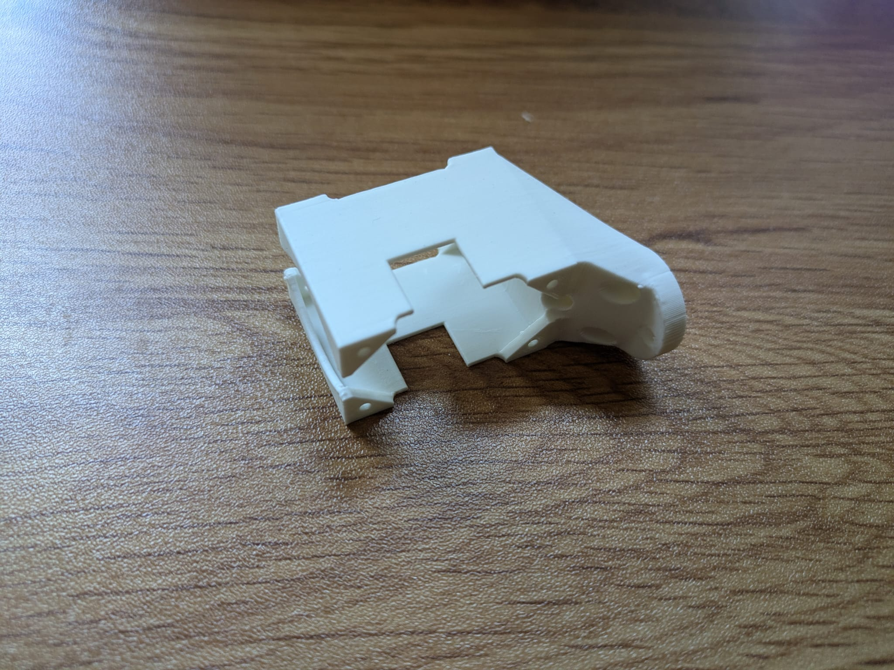 Part 6</td>
  </tr>
</table>

*Slice the STLs with your preferred slicer.*  
For a **right-hand leader arm**, mirror **Part 1** so the electronics face away from your hand.

---

## Mechanical Assembly

*Use **longer M2.5 screws** for the servo housing and **shorter screws** for the output shafts.*

1. **Base joint** – Mount actuator #1 to **Part 1** with its output shaft pointing toward the locating pin.  
2. **Shoulder joint** – Attach **Part 2** to actuator #1, then fasten actuator #2.  
3. **Elbow & wrist** – Assemble actuators #3, #4, #5 with their matching parts in order.  
4. **Forearm rotation** – Fasten **Part 6** to actuator #5 *before* installing actuator #6.  
5. **Gripper trigger** – Secure the handle, then add actuator #7 for the trigger.  
6. **Cable routing**  
   - Servo #2 → #3: port on #2 facing #3 → **lower** port on #3  
   - Servo #3 → #4: **upper** port on #3 → lower port on #4  
   - Remaining links can be connected in any order.  
7. **Control board** – Press the control board into its slots, seating each corner with a screwdriver.

---
## Usage
The Servos need to be numbered from the board away 1, 2, 3... this [adapted lerobot repo](https://github.com/robot-learning-co/lerobot/tree/main) 
 can be used to get started with the teleop. Just make sure to choose the right branche for the arm you want to use and to flash each servo with the correct id first using the configure_motor.py script. 

### Calibration Poses

Run the LeRobot calibration script and place the arm as shown below.  
Only the handle orientation differs between right- and left-hand versions.  
In all cases, the **trigger must be fully open** in both the initial and calibration poses.

<table>
  <tr>
    <td align="center">
      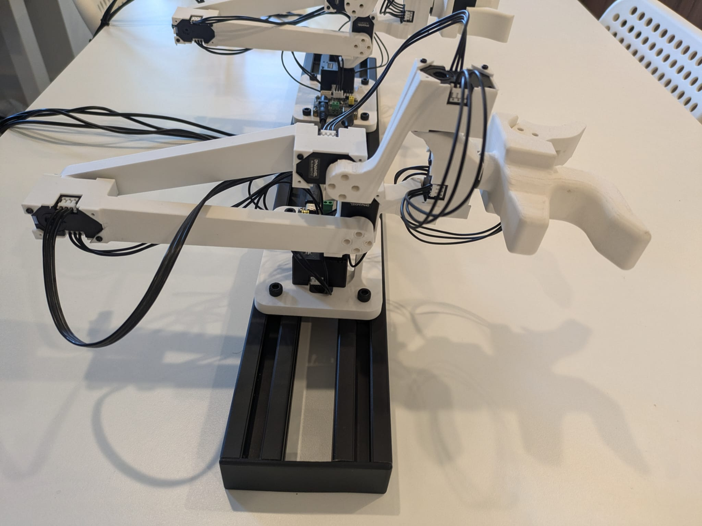 
      Initial pose — right arm
    </td>
    <td align="center">
      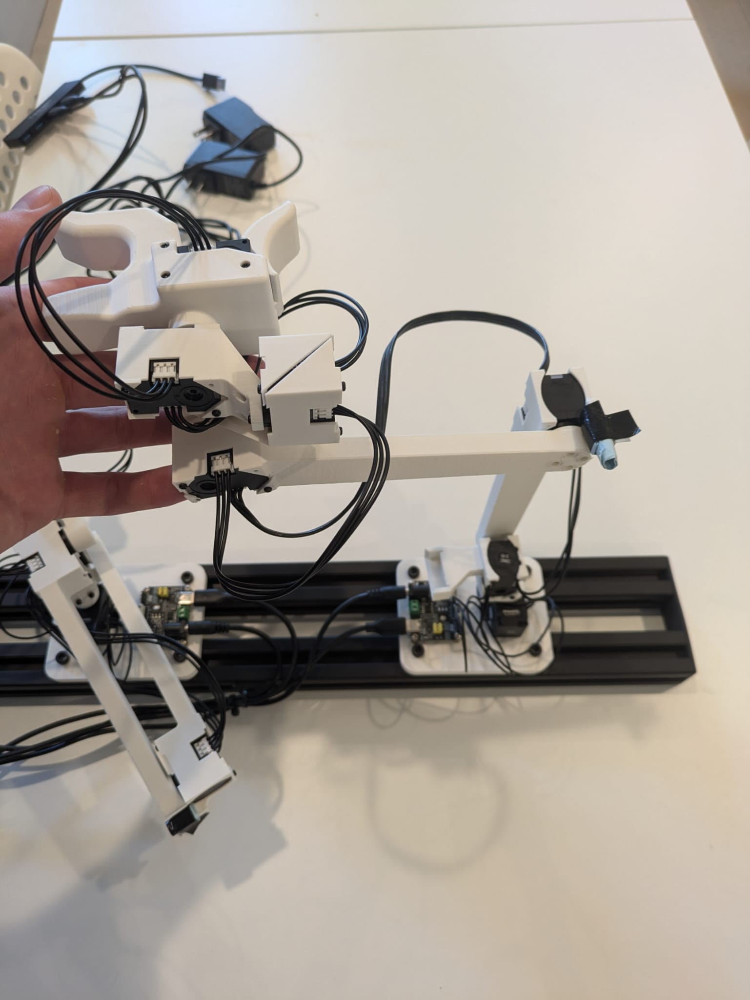 
      Calibration pose — right arm
    </td>
    <td align="center">
      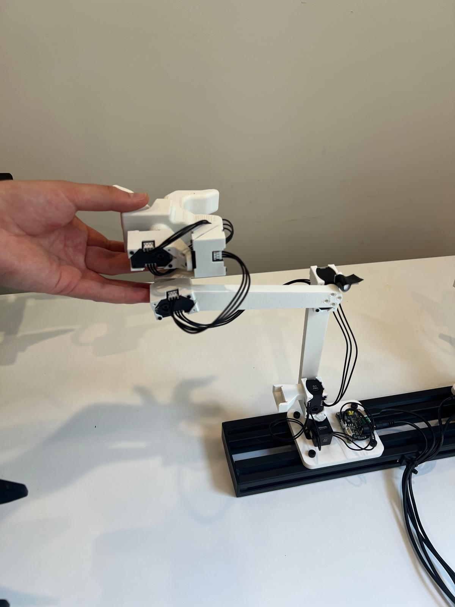 
      Calibration pose — left arm
    </td>
  </tr>
</table>

---

### Teleoperation

The grip may feel unfamiliar at first. It helps to, **keep your hand relaxed** and avoid actively pinching the handle.

<table>
  <tr>
    <td align="center">
      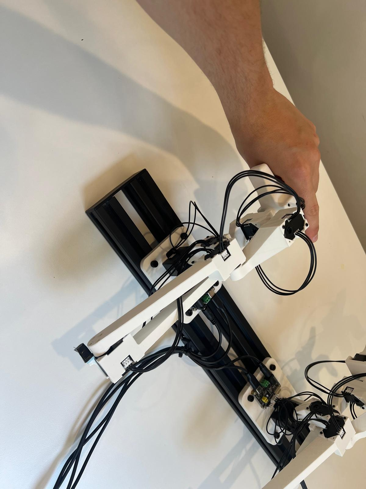 
      Recommended hand position
    </td>
  </tr>
</table>

<!-- 

  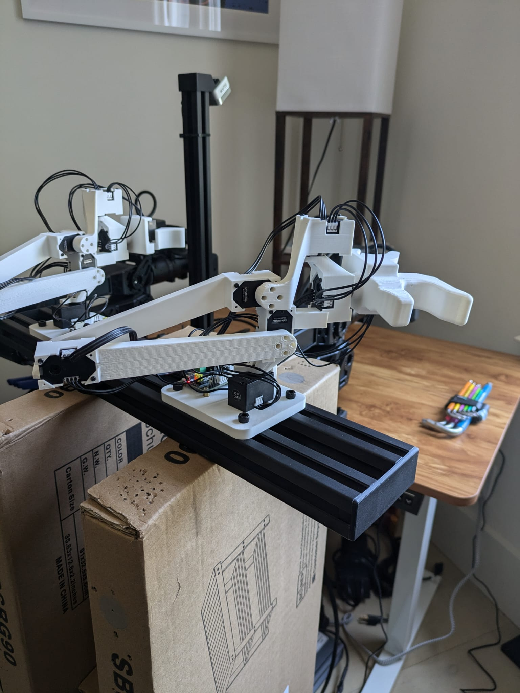

This Robot arm is kinematic äquivaletnt to the Arx_r5 (https://arx-x.com/?product/22.html) and the Trossen_WidowX_AI (https://www.trossenrobotics.com/widowx-ai) ams and can be used as a leader arm for them. The arm is 60% the size of the original arms and costs 180 dollars. 
It is a cheaper alternative to the manufacutres leader arms, while being easyer to handle, since the actuators are more backdrivable, this is expecialy helpfull for precise movement and effort less movement, of the grippers. The backside is that there is no force feedback.  
The gripper is taken from here https://github.com/wuphilipp/gello_mechanical?tab=readme-ov-file

## Parts
per arm:
7x actuators (https://en.robotis.com/shop_en/item.php?it_id=902-0162-000)  
1x control board: (https://www.amazon.com/Waveshare-Integrates-Control-Circuit-Supports/dp/B0CTMM4LWK/?th=1)
power supply: (https://www.amazon.com/Arkare-100V-240V-Replacement-Security-Raspberry-Pi/dp/B09W8X9VGK/)
1x usb-c cable 
3D printed parts:
<table>
  <tr>
    <td align="center">
       
      Part 1
    </td>
    <td align="center">
       
      Part 2
    </td>
    <td align="center">
       
      Part 3
    </td>
    <td align="center">
       
      Part 4
    </td>
    <td align="center">
       
      Part 5
    </td>
    <td align="center">
       
      Part 6
    </td>
  </tr>
</table>
They need to be sliced and printed by the slicer and printer of your choise. When doing a leader arm for a right arm it makes sense to mirror the part_1 in your slicer software to have the electronics loocking away from your arm.

## Assembly
the longer screws are for connecting the stationary part of the dynamixel and the shorter screws are to connect to the axis of the actuators. In general the cable connectors always fit the spaces for the cables in the plastic parts. That defines the orientations of the actuators
### To make sure the assembly works fist try, follow this assembly steps:
1. screw the fist arctuator on part_1, orient the axis towarst the pin.
2. first screw part_2 onto servo nr. 1, the add servo nr. 2
3. part and servo 3, 4 and 5 are strait forward to assemble
4. part 6 needs to be attaced to servo 5 before mounting servo 6
5. also the main handle part needs to be attached before the trigger servo is added
6. when using the default cables from the servos, it is importatnt to have the cable from servo 2 to servo 3, using port of servo 2 that faces servo 3 and the lower port of servo 3. For the cable from servo 3 to 4 the upper port of servo 3 and the lower port of servo 4 must be chosen. For the rest ther is no mendetory order to follow. 
7. The motor contorl bord is best pushed into the holes by pushing on the screws with a screw driver one after the other

## Usage
The Servos need to be numbered from the board away 1, 2, 3... this (https://github.com/robot-learning-co/lerobot/tree/main) adapted lerobot repo can be used to get started with the teleop. Just make sure to choose the right branche for the arm you want to use and to flash each servo with the correct id first using the configure_motor.py script. 

### Callibration positions
When using the calibration lerobot script, these are the calibration positions. Note that only the direction of the handele is inverted between right and left leader arm, and for the initial and calibration position, the trigger needs to be fully open.
<table>
  <tr>
     <td align="center">
       
      Initial position right arm
    </td>
    <td align="center">
       
      Calibration position right arm 
    </td>
    <td align="center">
       
      Calibration position left arm 
    </td>
  </tr>
</table>

### Teleoperation
This picture shows how to use the gripper for teleoperation, it needs some time to get used to it. It's helpfull to keep the hand relaxed and not try to pinch the handle.
<table>
  <tr>
     <td align="center">
       
      Hand position for theleoperation
    </td>
  </tr>
</table> -->