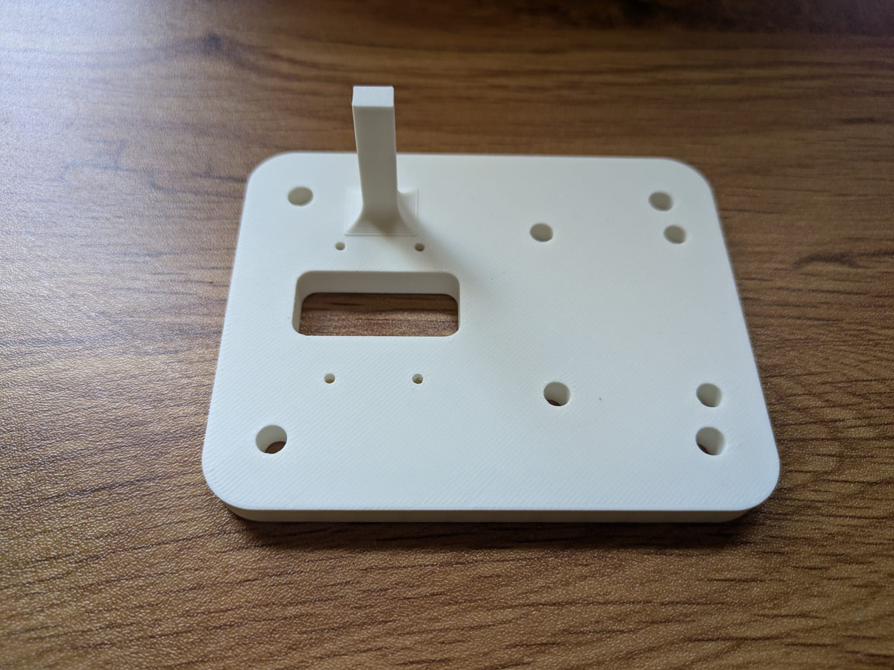

  

# Compact Leader Arm

This **leader arm** is **kinematically equivalent** to the [ARX-R5](https://arx-x.com/?product/22.html) and [Trossen WidowX-AI](https://www.trossenrobotics.com/widowx-ai) arms.
It is **60 % of their size** and around **USD 186** in parts, an affordable alternative for teleoperation.

Because the X330 actuators are **highly back-drivable**, the arm feels smooth and effortless when you guide it by hand—ideal for precise motion demonstrations. Especialy the gripper on the original arms is hard to close when using the same base arm for leader and flower.  
> **Limitations:** The design does **not include force-feedback sensors**.

The gripper is adapted from [Philipp Wu’s open-source model](<https://github.com/wuphilipp/gello_mechanical>).

---

## Bill of Materials (per arm)

| Qty | Item | Link | Price |
|-----|------|------|-------|
| 7 × | **Dynamixel XL330-M077-T** | [ROBOTIS](<https://en.robotis.com/shop_en/item.php?it_id=902-0162-000>) | $23.90
| 1 × | **Servo Control Board**| [Amazon](<https://www.amazon.com/dp/B0CTMM4LWK>) | $10.55 |
| 1 × | **power supply** 5V | [Amazon](<https://www.amazon.com/dp/B09W8X9VGK>) | $7.99 |
| 1 × | **USB-C cable** | — |
| —   | **3-D-printed parts** (STLs below) | — |

### 3-D-Printed Parts

<table>
  <tr>
    <td align="center"> Part 1</td>
    <td align="center"> Part 2</td>
    <td align="center"> Part 3</td>
    <td align="center"> Part 4</td>
    <td align="center"> Part 5</td>
    <td align="center"> Part 6</td>
  </tr>
</table>

*Slice the STLs with your preferred slicer.*  
For a **right-hand leader arm**, mirror **Part 1** so the electronics face away from your hand.

---

## Mechanical Assembly

*Use **longer M2.5 screws** for the servo housing and **shorter screws** for the output shafts.*

1. **Base joint** – Mount actuator #1 to **Part 1** with its output shaft pointing toward the locating pin.  
2. **Shoulder joint** – Attach **Part 2** to actuator #1, then fasten actuator #2.  
3. **Elbow & wrist** – Assemble actuators #3, #4, #5 with their matching parts in order.  
4. **Forearm rotation** – Fasten **Part 6** to actuator #5 *before* installing actuator #6.  
5. **Gripper trigger** – Secure the handle, then add actuator #7 for the trigger.  
6. **Cable routing**  
   - Servo #2 → #3: port on #2 facing #3 → **lower** port on #3  
   - Servo #3 → #4: **upper** port on #3 → lower port on #4  
   - Remaining links can be connected in any order.  
7. **Control board** – Press the control board into its slots, seating each corner with a screwdriver.

---
## Usage
The Servos need to be numbered from the board away 1, 2, 3... this [adapted lerobot repo](https://github.com/robot-learning-co/lerobot/tree/main) 
 can be used to get started with the teleop. Just make sure to choose the right branche for the arm you want to use and to flash each servo with the correct id first using the configure_motor.py script. 

### Calibration Poses

Run the LeRobot calibration script and place the arm as shown below.  
Only the handle orientation differs between right- and left-hand versions.  
In all cases, the **trigger must be fully open** in both the initial and calibration poses.

<table>
  <tr>
    <td align="center">
       
      Initial pose — right arm
    </td>
    <td align="center">
       
      Calibration pose — right arm
    </td>
    <td align="center">
       
      Calibration pose — left arm
    </td>
  </tr>
</table>

---

### Teleoperation

The grip may feel unfamiliar at first. It helps to, **keep your hand relaxed** and avoid actively pinching the handle.

<table>
  <tr>
    <td align="center">
       
      Recommended hand position
    </td>
  </tr>
</table>